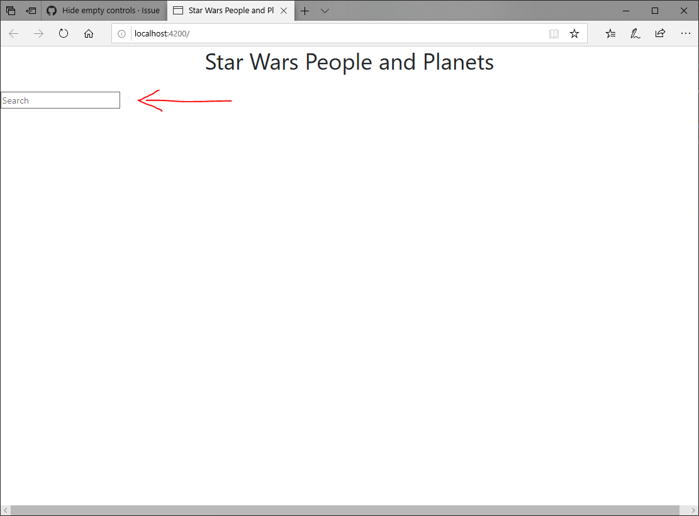
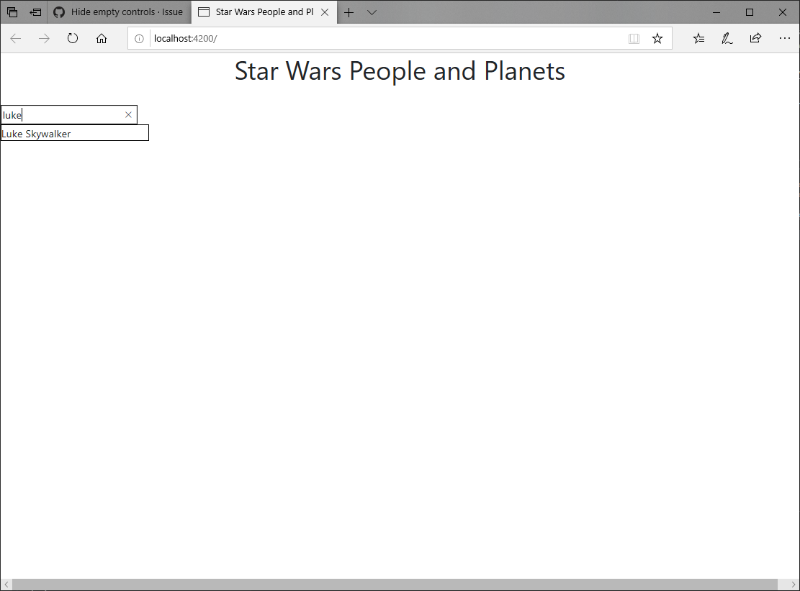
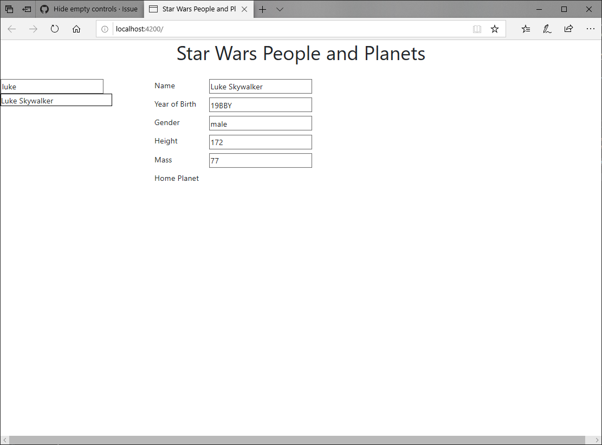
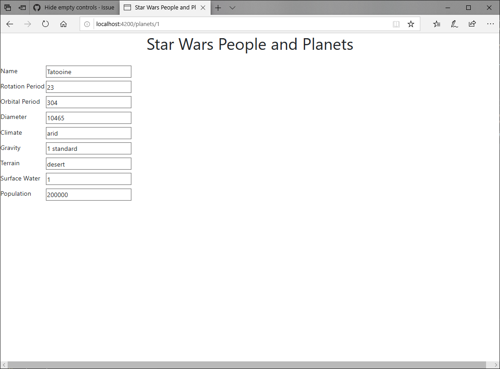

# Star Wars People and Planets

Generated with [Angular CLI](https://github.com/angular/angular-cli) version 1.4.9.

Utilizes HttpClient to call Star Wars API at https://swapi.co.

Clone and run `npm install`

Run `ng serve --open`

Navigate to `http://localhost:4200/`

Type a search term into the Search box (Try "Luke").

Select from the list to view person details.

Click on _Home Planet_ to view Home Planet details.

